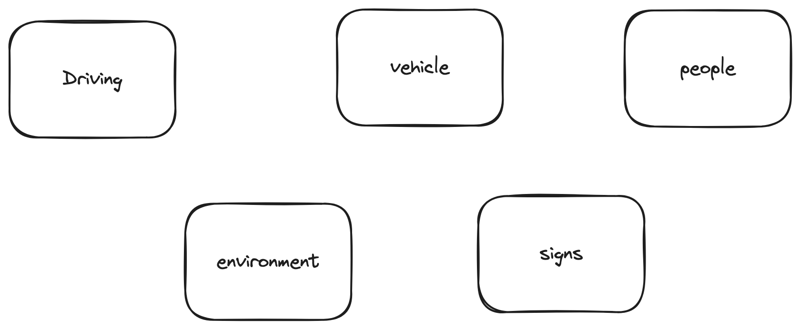
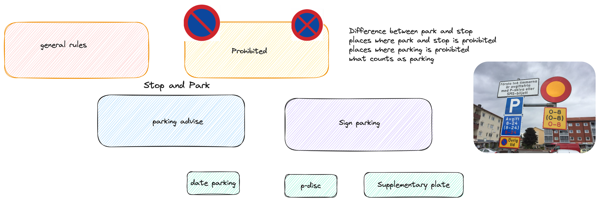
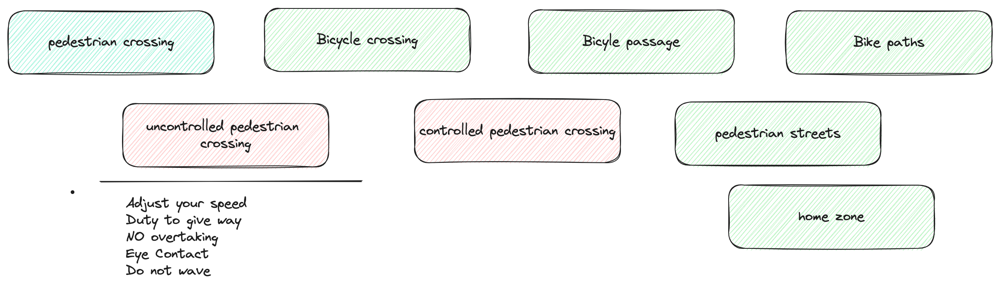

# High level overview

## Driving in towns and cities
- Unprotected road users
- Traffic signals and communication
- Positioning and lane selections
- Give Way Rules (https://www.ikorkort.nu/en/theory/stadskorning/vajningsregler.php)
  - Duty to Give way
  -  Priority to the right rule
  - junctions
  - Exit rule
  - Bus rule
  - obstacles
- Overtaking
  - Before overtaking
  - Overtaking prohibitions
  - Passing on the right side
  - Abort an overtaking
  - Cyclists and road maintenance
  - Trams
- Parking Rules
  - Before Parking
  - General Parking rules
  - Bus and tram stops
  - Parking signs
  - Alternate side parking
  - Parking on hills
  - Considerations when parking
  - mopeds
  

## Driving Part 1

- Stopping & Parking
  - https://www.sweetsweden.com/tourism-travel-sweden/rules-for-parking-your-car-in-sweden/
  - 
  - youtube link: https://www.youtube.com/watch?v=35XyRWfB-Yc
  - traffic youtube channel : https://www.youtube.com/@trafiko
  - korkortssidan: https://www.youtube.com/watch?v=nRYb1sjiA4g
  - skyltar: https://www.youtube.com/watch?v=0zDBv059iU0
- Pedestrian crossing, Bicycle crossing & Bike paths
  - bicyle passage vs bicycle crossing 
    - link:
      - https://korkortonline.se/teori/passager/
    - youtube:
      -  https://www.youtube.com/watch?v=uHmbZe4k-t0    
      https://www.youtube.com/watch?v=VLVQIO9aIqM
  - high level informaiton to remember 
  
- Roundabouts
  - link:
    - https://www.xn--vningskrning-3ibh.com/rad-cirkulationsplatser-rondeller/
    - https://korkortonline.se/teori/cirkulationsplats/
    - https://xn--krkort-wxa.se/rondell/
  - youtube:
    - https://www.youtube.com/watch?v=FBSFPHD8MEU
- Motorways & Clearways
- Country Roads
- Roadworks
- Level Crossings

## Driving Part 2
- Overtaking
- Driving in the dark
- Slippery Road Conditions
  - Can occur any time or any season
  - Risk is great
    - winter months
  - Hazardous Situation
    - Driving on slippery road conditions without being prepared
    - Temp < Freezing Point
      - Road users drive carefully
    - Temp == 0
      - moisture on road freeze quickly without drivers noticing
  - Spring & Autumn Conditions
    - Temp Fluctations
    - Frost
    - Patches of ice
    - Bridges & Viaducts
  - Summer Road Conditions
    - Road condition Best in summer months
    - poor condition can occur time to time
      - when it starts to rain after long period of warm and dry weather
      - risk of slippery is high
      - Water breaks up dirt and oil residues causing slippery mud to form on the road
        - once it rains heavily it gets rinsed away
  - Winter Road Conditions
    - Freezing Rain
    - Snow Tracks
    - Snow in the middle of the road
    - Polished snow
  - Tips for driving
    - Reduce speed, start car on second gear, reverse a little before driving
    - Braking without ABV brakes
    - Braking with ABS brakes
    - Aquaplanning
      - Increased RIsk
        - High Speed
        - Wide Tyres
        - Poor Tread depth
        - Large Quantities of water
- Obligations & Actions in traffic Accidents
  - Obligations
    - stay put
    - leave your details
    - move vehicles
    - contact the police
    - property damage
    - damage to a traffic device
  - In an Accident act in the following order
    - Survey the Accident site
    - Check the risk of fire
    - Help injured people and warn other road users
    - call 112
  - In an emergency - LBBC
    - Life threatening Situation
    - Breathing
    - Bleeding
    - Circulatory Shock
  - Emergency Stop
- Wildlife Accidents
  - Risk is high
    - at dusk and dawn
    - in may-june
    - in sep-oct
    - at the edge of forested areas
    - at clearings
    - at places where wildlife fencing begins and ends
- Trailers & Towing
  - read more details her [trailers & towing readme](Trailers-Towing.md)
  

## The Vehicle
- Stopping, Reaction and Breaking Distance
- Driving Characteristics
- Wheels & Tyres
- Break System & Steering System
- Safety in the car
- Engine's Auxiliary System
- Car's lighting
- Warning lamps & Check lamps
- Rules for the Car's load
- Inspection & Registration
- Insurance

##